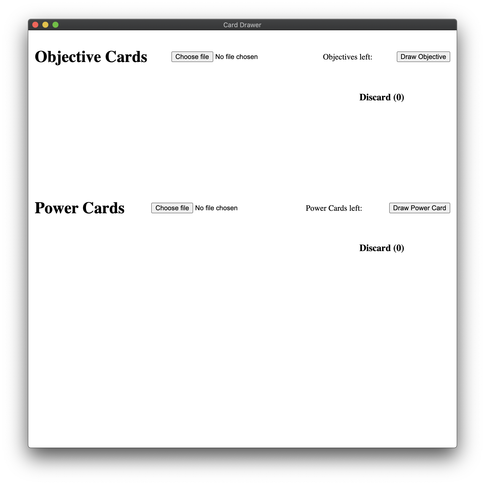

# card-drawer

It is 2020. And many people across the world cannot meet each other in person to play warhammer underworlds.

This little app is an experiment in making that a little easier, and a chance for me to have a little play with building an electron app in a few hours.

## Development

`yarn start`

## Building

`yarn && yarn package`

(This is designed to run on a mac, with `wine` installed.)

## Usage

The user must provide images of the cards they want to use. The UI has a directory picker which can be used to select the directory for a given deck. It only picks us `png` or `jpg` extensions.

